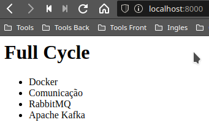

# docker-nginx-node-mysql

Desafio - Configurar um container nginx para que ao ser acessado, mostre os dados de uma aplicação rodando em um container interno que por sua vez obtem dados de um container contendo um banco de dados mysql

## Como rodar

- Clone o repositório na sua máquina
(A imagem nodeapi está no [Docker Hub](https://hub.docker.com/r/andressandrade/nodeapi) )

- Crie uma rede bridge para os containers se comunicarem   `docker network create --driver bridge nodeapi`

- Acesse a pasta mysql e inicie o container do mysql
  `docker run -d --rm --name mysql -e MYSQL_ROOT_PASSWORD=root MYSQL_DATABASE=fullcycle -v $(pwd)/data:/var/lib/mysql  --network nodeapi andressandrade/mysql`

- Acesse a pasta nodeapi, e inicie o container da nodeapi   `docker run --name nodeapi -v "$(pwd):/usr/scr/app" -d --network nodeapi andressandrade/nodeapi`

- Acesse a pasta nginx-revese, e inicie o container do nginx   `docker run -p 8080:80 -d --network nodeapi  andressandrade/nginx `

- Acesse http://localhost:8080

## Resultado

  

